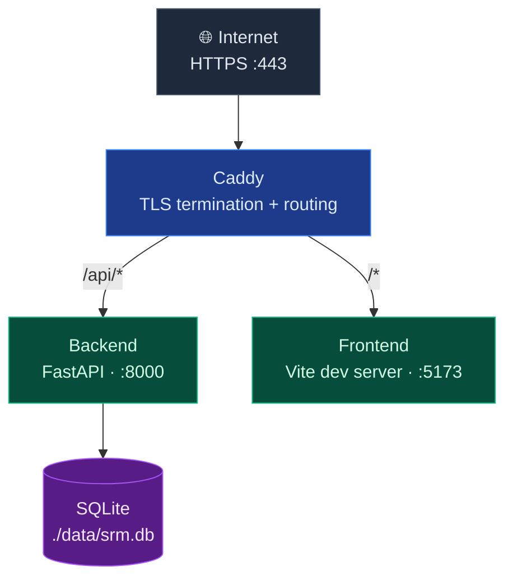

# Architecture

Documento di riferimento sull'architettura, le scelte tecniche e le convenzioni di SRM.

---

## 1. Obiettivo del sistema

Tool web self-hosted per gestione relazioni con fornitori e costruttori di macchine in azienda metalmeccanica. Caso d'uso interno (1-5 utenti). Non è un SaaS pubblico.

---

## 2. Stack tecnologico

### Backend
| Componente | Tecnologia | Note |
|---|---|---|
| Web framework | FastAPI ≥ 0.111 | Python 3.12 |
| ORM | SQLAlchemy 2.x | API moderna con `DeclarativeBase` |
| Migrazioni | Alembic | Generate da `Base.metadata` |
| Validazione | Pydantic v2 | `model_config = {"from_attributes": True}` |
| Database | SQLite | Migrabile a PostgreSQL via cambio `DATABASE_URL` |
| Auth | JWT (`python-jose`) + `bcrypt` 4.x | No `passlib` (dipendenza abbandonata) |
| Scheduler | APScheduler | Embedded, no broker esterno |
| Container | Python 3.12-slim |

### Frontend
| Componente | Tecnologia | Note |
|---|---|---|
| UI library | React 18 | Functional components + hooks |
| Bundler/dev server | Vite 5 | HMR via WebSocket through Caddy |
| Routing | React Router 6 | `BrowserRouter` |
| State server-side | TanStack Query 5 | Cache automatica, invalidazione esplicita |
| State client-side | React Context (auth) + `useState` | Niente Redux/Zustand |
| Styling | Tailwind CSS 3 | Utility-first, no CSS custom |
| Container dev | Node 20-alpine |

### Infrastruttura
| Componente | Tecnologia | Note |
|---|---|---|
| Orchestrazione | Docker Compose | Single-host |
| Reverse proxy | Caddy 2 | HTTPS automatico via Let's Encrypt |
| VPS | Hetzner Cloud CX22 | 2 vCPU, 4 GB RAM |
| OS | Ubuntu 24.04 LTS |
| DNS | Cloudflare (modalità DNS only) | Proxy disabilitato per ACME challenge |
| Versionamento | Git + GitHub | SSH key auth, branch `main`/`dev` |

---

## 3. Architettura runtime

I container `backend` e `frontend` non hanno porte esposte direttamente sull'host: tutto il traffico passa obbligatoriamente da Caddy. La comunicazione interna avviene sulla rete Docker `srm_net` tramite hostname dei container (es. `backend:8000`, `frontend:5173`).

**Volumi persistenti:**
- `./data/` → database SQLite
- `./uploads/` → allegati (PDF, immagini caricate dagli utenti)
- `./caddy_data/` → certificati TLS Let's Encrypt

---

## 4. Data model

User                  ← autenticazione
 ├── id, username, email, hashed_password, is_active
Supplier              ← entità centrale
 ├── id, nome, tipo (FORNITORE | COSTRUTTORE | ENTRAMBI)
 ├── email, telefono, sito_web, indirizzo, citta, cap, paese
 ├── piva, codice_fiscale, note
 ├── is_deleted (soft delete), created_at, updated_at
 │
 ├── 1:N → Contact     ← referenti del fornitore
 ├── 1:N → Communication
 ├── 1:N → Contract    ← Fase 3
 ├── 1:N → Order       ← Fase 3
 └── 1:N → Machine     ← Fase 3
Contact
 └── supplier_id, nome, cognome, ruolo, email, telefono, note
Communication
 └── supplier_id, contact_id?, tipo (EMAIL|TELEFONO|VISITA|ALTRO)
data, oggetto, corpo_note, created_by, allegato_path?

Convenzioni DB:
- ID `INTEGER PRIMARY KEY AUTOINCREMENT`
- Tutti i timestamp `created_at`/`updated_at` con default automatico
- `Supplier` usa soft delete (`is_deleted=True`)
- `Contact`/`Communication` usano hard delete (sono accessori al fornitore)
- Allegati: path su filesystem in `./uploads/`, NO BLOB nel DB

---

## 5. API REST

Base URL: `/api/v1/`. Tutti gli endpoint richiedono `Authorization: Bearer <token>` tranne `POST /auth/token`.
POST   /auth/register             ← crea utente
POST   /auth/token                ← login (form-data, OAuth2 password flow)
GET    /suppliers/                ← lista paginata + filtri (?page&size&search&tipo)
POST   /suppliers/
GET    /suppliers/{id}
PUT    /suppliers/{id}
DELETE /suppliers/{id}            ← soft delete
POST   /contacts/
GET    /contacts/{id}
PUT    /contacts/{id}
DELETE /contacts/{id}
GET    /communications/supplier/{supplier_id}
POST   /communications/
PUT    /communications/{id}
DELETE /communications/{id}

Risposta liste: `{ "items": [...], "total": N, "page": P, "size": S }`.
Risposta errori: `{ "detail": "messaggio" }`.

Documentazione interattiva: `/api/v1/docs` (Swagger UI).

---

## 6. Frontend architecture

src/
├── main.jsx                  ← entry React
├── App.jsx                   ← Provider tree + Routes
├── api/
│   ├── client.js             ← fetch wrapper con auth header + 401 handler
│   ├── suppliers.js          ← funzioni CRUD per resource
│   ├── contacts.js
│   └── communications.js
├── hooks/
│   ├── useAuth.jsx           ← AuthContext + useAuth hook
│   ├── useSuppliers.js       ← React Query hooks (read + mutations)
│   ├── useContacts.js
│   └── useCommunications.js
├── components/
│   ├── Modal.jsx             ← UI primitives riusabili
│   ├── Tabs.jsx
│   ├── ProtectedRoute.jsx
│   ├── SupplierForm.jsx      ← form (create + edit via prop initial)
│   ├── ContactForm.jsx
│   └── CommunicationForm.jsx
├── pages/
│   ├── Login.jsx
│   ├── Suppliers.jsx         ← list page
│   └── SupplierDetail.jsx    ← detail con tabs
└── utils/
└── format.js             ← formattazione date locale-it

### Pattern adottati
- **API module pattern**: una funzione per ogni endpoint, mai fetch inline nei componenti
- **React Query come data layer**: cache, invalidazione, retry, loading/error stato
- **Query key normalizzate**: `String(id)` ovunque per evitare cache miss da type mismatch
- **Form polimorfici**: stessa form per create e edit via prop `initial`
- **Stato modale a tre valori**: `null` (chiuso), `{}` (nuovo), `{...id}` (modifica)

---

## 7. Auth flow

Login form → POST /auth/token (form-data) → access_token JWT
↓
localStorage.setItem('srm_token', token)
↓
AuthContext aggiorna isAuthenticated=true → React Router navigate('/suppliers')
↓
Ogni fetch successivo: client.js legge token, aggiunge header Authorization
↓
401 response → localStorage.clear + window.location='/login'

Token validità: 480 minuti (8 ore). Niente refresh token in questa fase.

---

## 8. Convenzioni di codice

- **Python**: snake_case · type hints obbligatori · docstring sulle funzioni pubbliche · `logging` standard library, no `print()`
- **JavaScript**: PascalCase per componenti React, camelCase per il resto · ES modules · arrow functions
- **Git commit**: Conventional Commits (`feat:`, `fix:`, `docs:`, `refactor:`, `chore:`)
- **Branch**: `main` (stabile, solo merge da dev su milestone), `dev` (sviluppo continuo), `feature/<nome>` per feature lunghe

---

## 9. Sicurezza

| Area | Misura |
|---|---|
| Trasporto | HTTPS forzato via Caddy + HSTS auto |
| Auth | JWT firmato HS256 con `SECRET_KEY` random 64 char |
| Password | Hash bcrypt (cost factor default 12) |
| SSH server | Login root disabilitato, key-only, fail2ban attivo |
| DB | Bind mount fuori dal container, no porte esposte |
| Frontend | Token in `localStorage` (vulnerabile XSS — accettato per ambito interno) |

Hardening avanzato in roadmap Fase 6: rate limiting, log strutturati, multi-utente con ruoli, container non-root.
