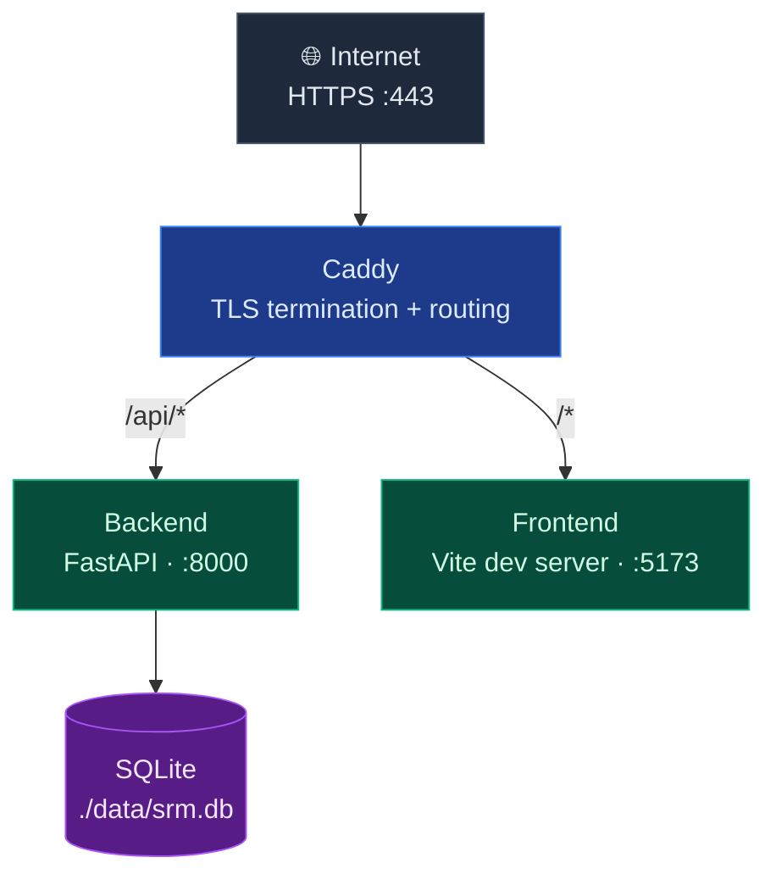
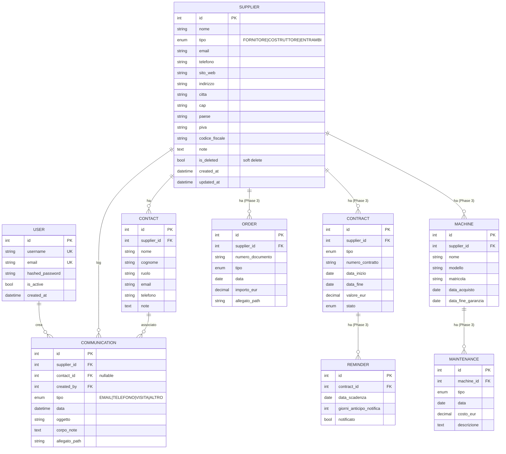
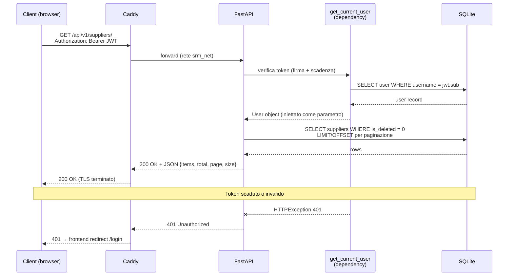
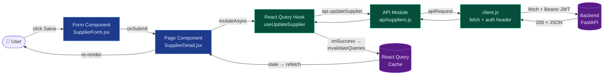
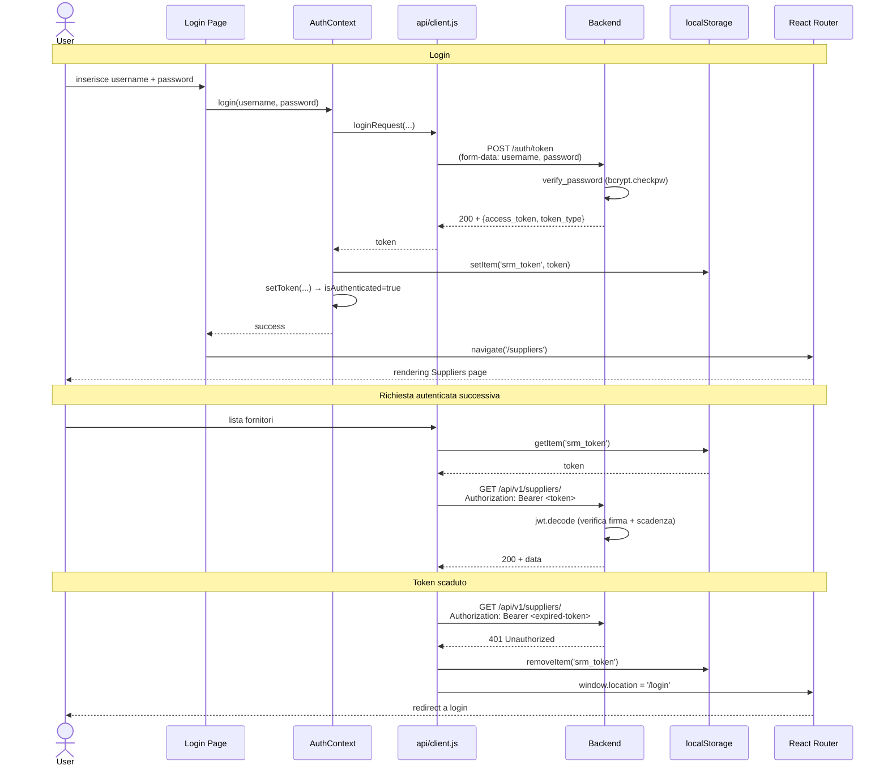

# Architecture

Documento di riferimento sull'architettura, le scelte tecniche e le convenzioni di SRM.

---

## 1. Obiettivo del sistema

Tool web self-hosted per gestione relazioni con fornitori e costruttori di macchine in azienda metalmeccanica. Caso d'uso interno (1-5 utenti). Non è un SaaS pubblico.

---

## 2. Stack tecnologico

### Backend
| Componente | Tecnologia | Note |
|---|---|---|
| Web framework | FastAPI ≥ 0.111 | Python 3.12 |
| ORM | SQLAlchemy 2.x | API moderna con `DeclarativeBase` |
| Migrazioni | Alembic | Generate da `Base.metadata` |
| Validazione | Pydantic v2 | `model_config = {"from_attributes": True}` |
| Database | SQLite | Migrabile a PostgreSQL via cambio `DATABASE_URL` |
| Auth | JWT (`python-jose`) + `bcrypt` 4.x | No `passlib` (dipendenza abbandonata) |
| Scheduler | APScheduler | Embedded, no broker esterno |
| Container | Python 3.12-slim |

### Frontend
| Componente | Tecnologia | Note |
|---|---|---|
| UI library | React 18 | Functional components + hooks |
| Bundler/dev server | Vite 5 | HMR via WebSocket through Caddy |
| Routing | React Router 6 | `BrowserRouter` |
| State server-side | TanStack Query 5 | Cache automatica, invalidazione esplicita |
| State client-side | React Context (auth) + `useState` | Niente Redux/Zustand |
| Styling | Tailwind CSS 3 | Utility-first, no CSS custom |
| Container dev | Node 20-alpine |

### Infrastruttura
| Componente | Tecnologia | Note |
|---|---|---|
| Orchestrazione | Docker Compose | Single-host |
| Reverse proxy | Caddy 2 | HTTPS automatico via Let's Encrypt |
| VPS | Hetzner Cloud CX22 | 2 vCPU, 4 GB RAM |
| OS | Ubuntu 24.04 LTS |
| DNS | Cloudflare (modalità DNS only) | Proxy disabilitato per ACME challenge |
| Versionamento | Git + GitHub | SSH key auth, branch `main`/`dev` |

---

## 3. Architettura runtime

I container `backend` e `frontend` non hanno porte esposte direttamente sull'host: tutto il traffico passa obbligatoriamente da Caddy. La comunicazione interna avviene sulla rete Docker `srm_net` tramite hostname dei container (es. `backend:8000`, `frontend:5173`).

**Volumi persistenti:**
- `./data/` → database SQLite
- `./uploads/` → allegati (PDF, immagini caricate dagli utenti)
- `./caddy_data/` → certificati TLS Let's Encrypt

---

## 4. Data model

Diagramma entità-relazione. Le entità marcate (Phase 3) sono in roadmap.

### Convenzioni DB
- ID `INTEGER PRIMARY KEY AUTOINCREMENT` (SQLite) / `SERIAL` (Postgres)
- Timestamp `created_at`/`updated_at` con default automatico
- `Supplier` usa soft delete (`is_deleted=True`)
- `Contact`/`Communication` usano hard delete (entità accessorie)
- Allegati su filesystem in `./uploads/`, NO BLOB nel DB

## 5. API REST

Base URL: `/api/v1/`. Tutti gli endpoint richiedono `Authorization: Bearer <token>` tranne `POST /auth/token`.

### Ciclo di vita di una richiesta autenticata

### Endpoint principali

| Method | Path | Descrizione |
|---|---|---|
| `POST` | `/auth/register` | Crea nuovo utente |
| `POST` | `/auth/token` | Login (form-data, restituisce JWT) |
| `GET` | `/suppliers/` | Lista paginata + filtri (`?page&size&search&tipo`) |
| `POST` | `/suppliers/` | Crea fornitore |
| `GET` | `/suppliers/{id}` | Dettaglio (include `contacts` annidati) |
| `PUT` | `/suppliers/{id}` | Aggiorna parziale |
| `DELETE` | `/suppliers/{id}` | Soft delete |
| `POST` | `/contacts/` | Crea contatto |
| `GET` | `/contacts/{id}` | Dettaglio |
| `PUT` | `/contacts/{id}` | Aggiorna |
| `DELETE` | `/contacts/{id}` | Hard delete |
| `GET` | `/communications/supplier/{supplier_id}` | Lista cronologica per fornitore |
| `POST` | `/communications/` | Crea |
| `PUT` | `/communications/{id}` | Aggiorna |
| `DELETE` | `/communications/{id}` | Hard delete |

### Convenzioni di risposta
- Liste: `{ "items": [...], "total": N, "page": P, "size": S }`
- Errori: `{ "detail": "messaggio" }`
- Documentazione interattiva: `/api/v1/docs` (Swagger UI)

## 6. Frontend architecture

### Pipeline dati: dal click utente al re-render

### Struttura cartelle

src/
├── main.jsx                  ← entry React
├── App.jsx                   ← Provider tree + Routes
├── api/
│   ├── client.js             ← fetch wrapper con auth header + 401 handler
│   ├── suppliers.js          ← funzioni CRUD per resource
│   ├── contacts.js
│   └── communications.js
├── hooks/
│   ├── useAuth.jsx           ← AuthContext + useAuth hook
│   ├── useSuppliers.js       ← React Query hooks (read + mutations)
│   ├── useContacts.js
│   └── useCommunications.js
├── components/
│   ├── Modal.jsx             ← UI primitives riusabili
│   ├── Tabs.jsx
│   ├── ProtectedRoute.jsx
│   ├── SupplierForm.jsx      ← form polimorfico (create + edit)
│   ├── ContactForm.jsx
│   └── CommunicationForm.jsx
├── pages/
│   ├── Login.jsx
│   ├── Suppliers.jsx         ← list page
│   └── SupplierDetail.jsx    ← detail con tabs
└── utils/
└── format.js             ← formattazione date locale-it

### Pattern adottati
- **API module pattern**: una funzione per ogni endpoint, mai `fetch` inline nei componenti
- **React Query come data layer**: cache automatica, invalidazione esplicita, retry, stato loading/error
- **Query key normalizzate**: `String(id)` ovunque per evitare cache miss da type mismatch
- **Form polimorfici**: stesso componente per create e edit via prop `initial`
- **Stato modale a tre valori**: `null` (chiuso), `{}` (nuovo), `{...id}` (modifica)

## 7. Auth flow

**Caratteristiche del flusso:**
- Token JWT firmato HS256 con `SECRET_KEY` random 64 char
- Validità token: 480 minuti (8 ore)
- Niente refresh token in questa fase (richiede nuovo login a scadenza)
- Token salvato in `localStorage` (vulnerabile XSS — accettato per ambito interno; in roadmap Fase 6 valutare httpOnly cookie)
- Verifica password con bcrypt (cost factor default 12) — limite 72 byte gestito esplicitamente

## 8. Convenzioni di codice

- **Python**: snake_case · type hints obbligatori · docstring sulle funzioni pubbliche · `logging` standard library, no `print()`
- **JavaScript**: PascalCase per componenti React, camelCase per il resto · ES modules · arrow functions
- **Git commit**: Conventional Commits (`feat:`, `fix:`, `docs:`, `refactor:`, `chore:`)
- **Branch**: `main` (stabile, solo merge da dev su milestone), `dev` (sviluppo continuo), `feature/<nome>` per feature lunghe

---

## 9. Sicurezza

| Area | Misura |
|---|---|
| Trasporto | HTTPS forzato via Caddy + HSTS auto |
| Auth | JWT firmato HS256 con `SECRET_KEY` random 64 char |
| Password | Hash bcrypt (cost factor default 12) |
| SSH server | Login root disabilitato, key-only, fail2ban attivo |
| DB | Bind mount fuori dal container, no porte esposte |
| Frontend | Token in `localStorage` (vulnerabile XSS — accettato per ambito interno) |

Hardening avanzato in roadmap Fase 6: rate limiting, log strutturati, multi-utente con ruoli, container non-root.
